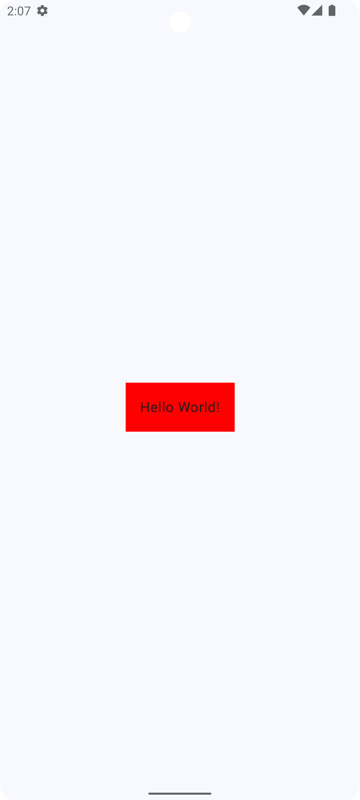
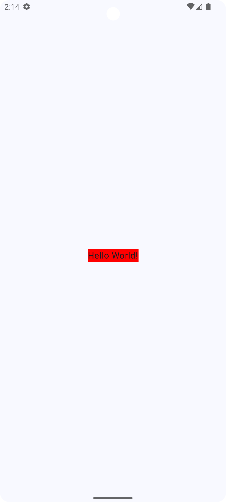
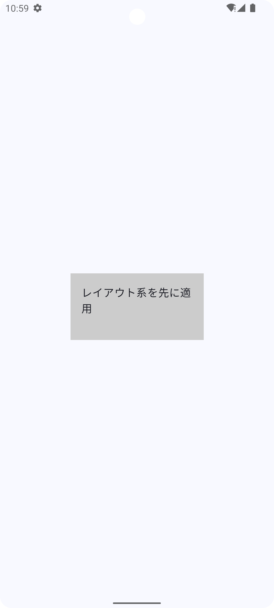
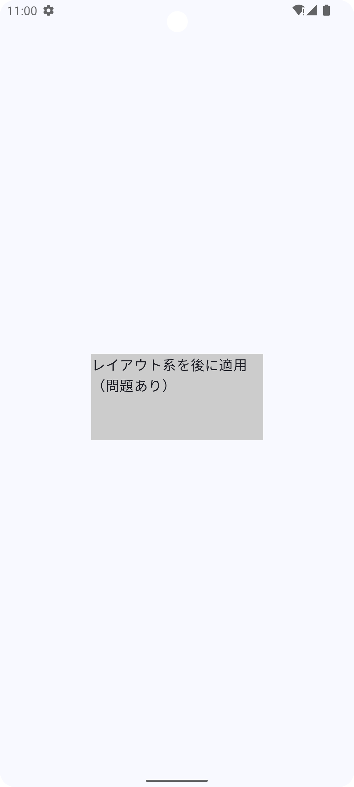
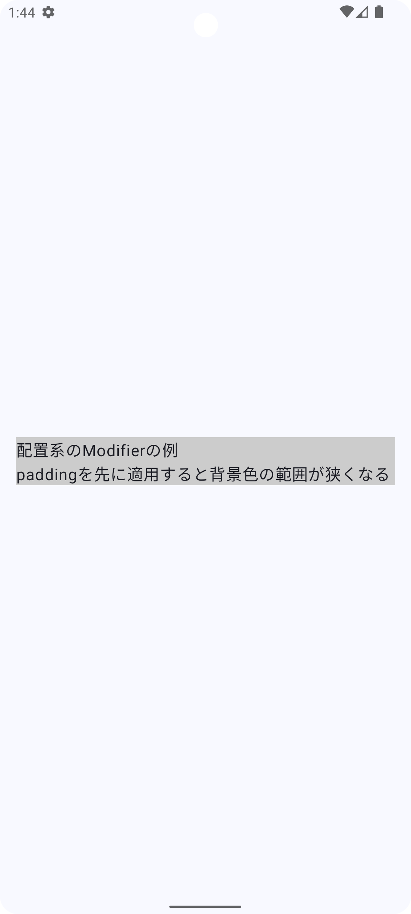
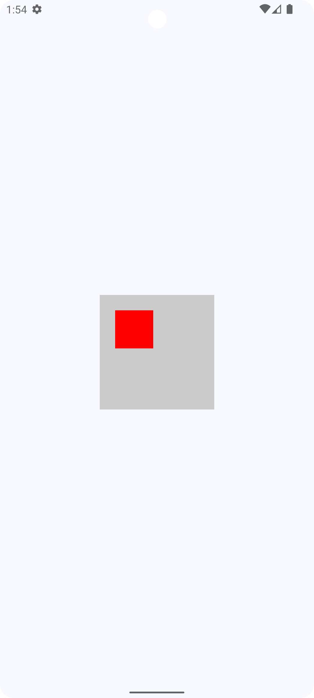

## はじめに

Jetpack ComposeはAndroidのUIを簡潔に構築できるフレームワークであり、その中でも***Modifier***は、レイアウトの調整や装飾、インタラクションの追加など幅広い用途で活用される重要な機能です。

しかし、***Modifier***の適用順序を誤ると、意図しないレイアウト崩れや想定外の動作を引き起こす可能性があります。本記事では、***Modifier***の適用順序がUIにどのような影響を与えるのかを図や具体例を交えながら、なるべく初学者の方にも理解しやすい形で解説していきます。

なお、***Modifier***とは何かや基本的な使い方については公式ドキュメントが詳しく解説しているので、以下のリンクを参考にしてください。
<br>
<br>
[Compose 修飾子](https://developer.android.com/develop/ui/compose/modifiers?hl=ja)

## Modifierは適用順序が重要

冒頭でも述べたように、***Modifier***の適用順序を誤ると意図しないレイアウト崩れや想定外の動作を引き起こす可能性があります。
***Modifier***は上から順に適用されるため、どの順番で設定するかによって見た目や動作が大きく変わります。

ここでは、Textコンポーネントに背景色（***background***）とパディング（***padding***）を適用するシンプルな例を見ていきます。

### backgroundを先に適用した場合

```kotlin
    Text(
        text = "Hello World!", modifier = modifier
            .background(Color.Red)
            .padding(16.dp)
    )
```



上記の場合、まずは***background***が評価され、Textのテキストサイズに応じて色がつきます。その後***padding***が評価され、Textに対して***padding***が追加されることによって全体のサイズが拡張されa（背景色に影響することによって大きく見える）。

次に***background***と***padding***の順序を逆にしてみます。

### paddingを先に適用した場合

```kotlin
    Text(
        text = "Hello World!", modifier = modifier
            .padding(16.dp)
            .background(Color.Red)
    )
```



すると、先ほどとは異なり、先に***padding***が評価され、背景色のサイズ自体は変わりません（***padding***が背景色に影響しないので大きさが変わらない）。
このように***Modifier***は、前後を入れ替えるだけで簡単にUIが変わってしまうため、複雑なレイアウトを組む際には適切な知識を組んでいく必要があります。

// ここから確認する

## なぜ順番が影響を与えるのか？

その理由は、Jetpack ComposeのUIは「UIツリー」という構造で管理されており、***Modifier***はこのツリー内でラップ構造として適用されるためです。

では、このUIツリーがどのように構築され、***Modifier***の適用順がどのように影響を与えるのかを具体的に見ていきましょう。

## UIツリーとは？

Jetpack ComposeのUIは、以下の3つのフェーズで構築されます。

### 1. コンポーズフェーズ

- Composable関数が評価され、UIツリーが生成される
- ここで、Text()やBox()などの組み込みコンポーザブルがUIツリー内に追加される

### 2. レイアウトフェーズ

- 親コンポーネントが子コンポーネントに「どのくらいのサイズで描画するか」を決める
- fillMaxSize(), size(100.dp), padding(16.dp) などの レイアウト関連の***Modifier***は、このフェーズで影響を受ける

### 3. 描画フェーズ

- UIツリーの情報を元に、実際に画面に描画する
- background(Color.Blue), clip(RoundedCornerShape(16.dp)), border(2.dp, Color.Black)などの描画関連の***Modifier***は、このフェーズで適用される

[UI ツリー内の修飾子](https://developer.android.com/develop/ui/compose/layouts/constraints-modifiers?hl=ja#modifiers-ui)に説明があるように、「***Modifier***はUIツリー内でノードをラップ」します。簡単に説明すると、***Modifier***を適用しているComposableを包み込むように適用されるということです。

<https://developer.android.com/develop/ui/compose/phases?hl=ja>

## Modifierを組む上でどのように意識したら良いか？

***レイアウト***→***配置***→***装飾***→***その他（クリックイベントやアニメーション）***
上記の順で***Modifier***を適用していきましょう。

## 具体例

Modifierの組み合わせ適用順を間違えたときの影響
background() + padding()背景色の適用範囲が意図しないものになる
size() + clip()size() を後に適用すると clip() の影響を受けない
fillMaxSize() + padding()fillMaxSize() を後に適用すると padding() が無視される
clickable() + background()clickable() を先に適用すると、タップ範囲が狭くなる

### 5つのカテゴリごとに解説

## Modifierの適用順序

| 順番 | カテゴリ         | 例                                      |
|------|--------------|--------------------------------------|
| 1️⃣  | **レイアウト系** | `size()`, `fillMaxSize()`, `weight()`  |
| 2️⃣  | **配置系**     | `padding()`, `align()`, `offset()`   |
| 3️⃣  | **描画系**     | `background()`, `border()`, `clip()` |
| 4️⃣  | **動作系**     | `clickable()`, `pointerInput()`      |
| 5️⃣  | **アニメーション系** | `alpha()`, `graphicsLayer()`         |

## カテゴリ別の実装サンプル

### 1️⃣ レイアウト系

レイアウト系のModifierは、コンポーネントの基本的なサイズや形状を決定します。これらは最初に適用するのが基本です。

```kotlin
Box(
    modifier = Modifier
        // レイアウト系: サイズを指定
        .size(width = 200.dp, height = 100.dp)
        // 以降のModifierはこのサイズに対して適用される
        .background(Color.LightGray)
        .padding(16.dp)
) {
    Text("レイアウト系を先に適用")
}
```



レイアウト系のModifierを後に適用すると、他のModifierの効果が無視されることがあります：

```kotlin
Box(
    modifier = Modifier
        // 先にpaddingを適用
        .padding(16.dp)
        // 後からサイズを指定すると、paddingの効果が見えなくなる
        .size(width = 200.dp, height = 100.dp)
        .background(Color.LightGray)
) {
    Text("レイアウト系を後に適用（問題あり）")
}
```



### 2️⃣ 配置系

配置系のModifierは、コンポーネントの位置や余白を調整します。レイアウト系の後に適用するのが適切です。

```kotlin
Column(
    modifier = Modifier
        .fillMaxWidth()
        // 配置系: paddingを適用
        .padding(16.dp)
        .background(Color.LightGray)
) {
    Text("配置系のModifierの例")
    Text("paddingを先に適用すると背景色の範囲が狭くなる")
}
```



`offset`を使った例：

```kotlin
Box(
    modifier = Modifier
        .size(150.dp)
        .background(Color.LightGray)
) {
    Box(
        modifier = Modifier
            .size(50.dp)
            // 配置系: offsetで位置をずらす
            .offset(x = 20.dp, y = 20.dp)
            .background(Color.Red)
    )
}
```



### 3️⃣ 描画系

描画系のModifierは、コンポーネントの見た目（背景色、境界線、形状など）を装飾します。

```kotlin
Box(
    modifier = Modifier
        .size(150.dp)
        .padding(16.dp)
        // 描画系: 背景色、角丸、境界線を適用
        .background(Color.LightGray, RoundedCornerShape(8.dp))
        .border(2.dp, Color.Black, RoundedCornerShape(8.dp))
) {
    Text("描画系のModifierの例", modifier = Modifier.align(Alignment.Center))
}
```

描画系のModifierの順序も重要です：

```kotlin
Row(
    modifier = Modifier.padding(16.dp)
) {
    // 正しい順序: clip -> background
    Box(
        modifier = Modifier
            .size(100.dp)
            .clip(CircleShape)
            .background(Color.Blue)
    )

    Spacer(modifier = Modifier.width(16.dp))

    // 誤った順序: background -> clip
    Box(
        modifier = Modifier
            .size(100.dp)
            .background(Color.Red)
            .clip(CircleShape) // 背景色の後にclipを適用しても効果がない
    )
}
```

### 4️⃣ 動作系

動作系のModifierは、タップやスワイプなどのユーザー操作に対する反応を定義します。

```kotlin
var clickCount by remember { mutableStateOf(0) }

Box(
    modifier = Modifier
        .size(150.dp)
        .padding(16.dp)
        .background(Color.LightGray)
        // 動作系: クリックイベントを追加
        .clickable { clickCount++ }
) {
    Text(
        text = "クリック回数: $clickCount",
        modifier = Modifier.align(Alignment.Center)
    )
}
```

動作系のModifierを先に適用すると、後から適用する視覚的なModifierに影響されないため、タップ可能な領域が意図したものと異なる場合があります：

```kotlin
Box(
    modifier = Modifier
        // 動作系を先に適用
        .clickable { /* クリックイベント */ }
        .size(150.dp)
        .padding(16.dp)
        .background(Color.LightGray)
) {
    Text("動作系を先に適用（問題あり）")
    // この場合、paddingやbackgroundで拡張された領域がクリック可能にならない
}
```

### 5️⃣ アニメーション系

アニメーション系のModifierは、透明度や変形などの視覚効果を動的に変化させます。

```kotlin
var isAnimating by remember { mutableStateOf(false) }
val alpha by animateFloatAsState(
    targetValue = if (isAnimating) 0.3f else 1.0f,
    label = "alpha"
)

Box(
    modifier = Modifier
        .size(150.dp)
        .padding(16.dp)
        .background(Color.LightGray)
        .clickable { isAnimating = !isAnimating }
        // アニメーション系: 透明度を変更
        .alpha(alpha)
) {
    Text("アニメーション系の例", modifier = Modifier.align(Alignment.Center))
}
```

`graphicsLayer`を使った例：

```kotlin
var isRotated by remember { mutableStateOf(false) }
val rotation by animateFloatAsState(
    targetValue = if (isRotated) 180f else 0f,
    label = "rotation"
)

Box(
    modifier = Modifier
        .size(150.dp)
        .padding(16.dp)
        .background(Color.LightGray)
        .clickable { isRotated = !isRotated }
        // アニメーション系: 回転効果を適用
        .graphicsLayer {
            rotationZ = rotation
        }
) {
    Text("回転アニメーション", modifier = Modifier.align(Alignment.Center))
}
```

## 複合的な例

実際のアプリ開発では、複数のカテゴリのModifierを組み合わせて使用することが一般的です。以下は、すべてのカテゴリを適切な順序で組み合わせた例です：

```kotlin
@Composable
fun ComplexModifierExample() {
    var isPressed by remember { mutableStateOf(false) }
    val scale by animateFloatAsState(
        targetValue = if (isPressed) 0.95f else 1f,
        label = "scale"
    )

    Box(
        contentAlignment = Alignment.Center,
        modifier = Modifier
            // 1️⃣ レイアウト系
            .fillMaxWidth()
            .height(120.dp)

            // 2️⃣ 配置系
            .padding(horizontal = 16.dp, vertical = 8.dp)

            // 3️⃣ 描画系
            .clip(RoundedCornerShape(12.dp))
            .background(MaterialTheme.colorScheme.primary)
            .border(
                width = 2.dp,
                color = MaterialTheme.colorScheme.onPrimary.copy(alpha = 0.2f),
                shape = RoundedCornerShape(12.dp)
            )

            // 4️⃣ 動作系
            .pointerInput(Unit) {
                detectTapGestures(
                    onPress = {
                        isPressed = true
                        tryAwaitRelease()
                        isPressed = false
                    }
                )
            }

            // 5️⃣ アニメーション系
            .graphicsLayer {
                scaleX = scale
                scaleY = scale
            }
    ) {
        Text(
            text = "すべてのカテゴリを組み合わせた例",
            color = MaterialTheme.colorScheme.onPrimary,
            style = MaterialTheme.typography.titleMedium
        )
    }
}
```

この例では、各カテゴリのModifierを推奨される順序で適用しています：

1. `fillMaxWidth()`と`height()`でレイアウトのサイズを設定
2. `padding()`で余白を追加
3. `clip()`、`background()`、`border()`で視覚的な装飾を適用
4. `pointerInput()`でタッチイベントを処理
5. `graphicsLayer()`でアニメーション効果を追加

## よくある間違いと解決策

### 間違い1: paddingとbackgroundの順序を逆にする

```kotlin
// bad
Box(
    modifier = Modifier
        .background(Color.Red)
        .padding(16.dp)
)

// good
Box(
    modifier = Modifier
        .padding(16.dp)
        .background(Color.Red)
)
```

解決策: 背景色の範囲を制御したい場合は、`padding()`を先に適用します。背景色を含めた全体にパディングを適用したい場合は、`background()`を先に適用します。

### 間違い2: clickableを後に適用する

```kotlin
// 間違い
Box(
    modifier = Modifier
        .size(100.dp)
        .padding(16.dp)
        .background(Color.Blue)
        .clickable { /* クリックイベント */ }
)

// 正しい
Box(
    modifier = Modifier
        .size(100.dp)
        .padding(16.dp)
        .background(Color.Blue)
        .clickable { /* クリックイベント */ }
)
```

解決策: `clickable()`は視覚的なModifierの後に適用して、視覚的に見えている領域全体がタップ可能になるようにします。

### 間違い3: clipとbackgroundの順序を逆にする

```kotlin
// 間違い
Box(
    modifier = Modifier
        .background(Color.Green)
        .clip(CircleShape)
)

// 正しい
Box(
    modifier = Modifier
        .clip(CircleShape)
        .background(Color.Green)
)
```

解決策: `clip()`は`background()`の前に適用して、背景色がクリップされた形状に合わせて描画されるようにします。

## まとめ

Jetpack ComposeのModifierは、適用順序によってUIの見た目や挙動が大きく変わります。本記事では、Modifierを以下の5つのカテゴリに分類し、適切な適用順序を解説しました：

1. **レイアウト系**: サイズや形状を決定する基本的なModifier（`size()`, `fillMaxSize()`など）
2. **配置系**: 位置や余白を調整するModifier（`padding()`, `align()`など）
3. **描画系**: 見た目を装飾するModifier（`background()`, `border()`など）
4. **動作系**: ユーザー操作に対する反応を定義するModifier（`clickable()`, `pointerInput()`など）
5. **アニメーション系**: 視覚効果を動的に変化させるModifier（`alpha()`, `graphicsLayer()`など）

これらのカテゴリを意識し、適切な順序でModifierを適用することで、意図したとおりのUIを実現できます。特に初学者の方は、Modifierの適用順序に注意して、UIの挙動を理解しながら開発を進めることをおすすめします。

また、複雑なUIを構築する際には、各ModifierがどのようにUIツリーに影響を与えるかを理解することが重要です。Jetpack Composeの公式ドキュメントやサンプルコードを参考にしながら、実際に様々な順序でModifierを適用して動作を確認してみることで、理解を深めることができるでしょう。

Modifierの適用順序を正しく理解することで、Jetpack Composeを使ったUI開発がより直感的かつ効率的になります。ぜひ本記事の内容を参考に、美しく機能的なUIを構築してください。

## 参考文献

- [制約と修飾子の順序](https://developer.android.com/develop/ui/compose/layouts/constraints-modifiers?hl=ja)<br>
- [JetpackComposeのModifierの順序について](https://zenn.dev/mitohato/articles/b9840ea54d66cd)<br>
- [Compose修飾子の順序](https://developer.android.com/jetpack/compose/modifiers?hl=ja#order)<br>
- [Jetpack Compose Modifier API](https://developer.android.com/reference/kotlin/androidx/compose/ui/Modifier)<br>
